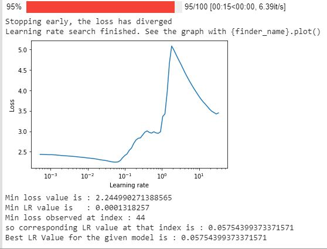

# EVA4 Assignment 10 - Suman Kanukollu


- [Github link](https://github.com/sumankanukollu/EVA_4_Assignments/blob/S_10_LRFinder_Misclassified_Cifar10/EVA_4_S10_Suman_Kanukollu_LRFinder_CIFAR_10.ipynb) 

- [Colab link](https://colab.research.google.com/drive/1jGgGJ6kNnGwnj_C2rKoKFs1vPw5mumDH?authuser=1#scrollTo=YiVNB8nL5Rtk)


# Model Summary:


----------
- Model Name: **Resnet18**

- No of parameters: **11,173,962**

- No of Epochs ran: **50**

	## Accuracy:
	- **Max. Train Accuracy** :  94.79 (@50th  epoch)
	- **Max. Test Accuracy**  :  91.05 (@47th epoch)
	## Loss:
	- **Min. Train Loss**     :  0.001190 (@50th epoch)
	- **Min. Test Loss**      :  0.002489 (@47th epoch)

	## Target (88%) Achieved at :
	- 23rd epoch  : *Test accuracy is : 88.17*


# Framework Structure:
	  - EVA_4_S10_Suman_Kanukollu_LRFinder_CIFAR_10.ipynb : It contains main workflow
	  - lib     : It contains all the functions related to Augmentation,Loaddataset,lrFinder,trainTestMethods
	  - models  : It contains Resnet model
	  - utils   : It contains helper functions such as progress bar and random images display and saveimages
	  - Sampleimages : Where user can place images for testing the code
	  - Output       : Network results will be saved here  

# LR Finder graph:



# Training and Test Accuracy curves:


# 25 misclassified Images:


# GradCam on 25 misclassified images:

# Logs

  - **Best accuracy**
		  
	```
	
		Epoch: 47
		 [================================================================>]  Step: 109ms | Tot: 1m4s | Train >> Loss: 0.163 | Acc: 94.312% (47156/50000) 391/391 
		 [================================================================>]  Step: 14ms | Tot: 2s946ms | Test >> Loss: 0.315 | Acc: 91.050% (9105/10000) 79/79 
		0.0024891174755990505


  - **Full Log**

    ```
    
    
		

		Epoch: 1
		 [================================================================>]  Step: 103ms | Tot: 1m4s | Train >> Loss: 1.713 | Acc: 37.426% (18713/50000) 391/391 
		 [================================================================>]  Step: 14ms | Tot: 2s971ms | Test >> Loss: 1.324 | Acc: 51.170% (5117/10000) 79/79 
		0.010457555067539216
		
		Epoch: 2
		 [================================================================>]  Step: 106ms | Tot: 1m3s | Train >> Loss: 1.327 | Acc: 52.088% (26044/50000) 391/391 
		 [================================================================>]  Step: 13ms | Tot: 2s867ms | Test >> Loss: 1.239 | Acc: 56.930% (5693/10000) 79/79 
		0.009785164427757263
		
		Epoch: 3
		 [================================================================>]  Step: 106ms | Tot: 1m3s | Train >> Loss: 1.123 | Acc: 59.972% (29986/50000) 391/391 
		 [================================================================>]  Step: 11ms | Tot: 2s899ms | Test >> Loss: 0.906 | Acc: 68.350% (6835/10000) 79/79 
		0.007157291334867477
		
		Epoch: 4
		 [================================================================>]  Step: 107ms | Tot: 1m4s | Train >> Loss: 0.964 | Acc: 65.698% (32849/50000) 391/391 
		 [================================================================>]  Step: 16ms | Tot: 2s981ms | Test >> Loss: 0.823 | Acc: 72.140% (7214/10000) 79/79 
		0.0065016945004463195
		
		Epoch: 5
		 [================================================================>]  Step: 104ms | Tot: 1m4s | Train >> Loss: 0.859 | Acc: 69.896% (34948/50000) 391/391 
		 [================================================================>]  Step: 15ms | Tot: 2s988ms | Test >> Loss: 0.715 | Acc: 75.660% (7566/10000) 79/79 
		0.005646986752748489
		
		Epoch: 6
		 [================================================================>]  Step: 101ms | Tot: 1m4s | Train >> Loss: 0.771 | Acc: 72.856% (36428/50000) 391/391 
		 [================================================================>]  Step: 9ms | Tot: 2s963ms | Test >> Loss: 0.644 | Acc: 77.840% (7784/10000) 79/79 
		0.00508598610162735
		
		Epoch: 7
		 [================================================================>]  Step: 108ms | Tot: 1m4s | Train >> Loss: 0.699 | Acc: 75.638% (37819/50000) 391/391 
		 [================================================================>]  Step: 11ms | Tot: 2s946ms | Test >> Loss: 0.566 | Acc: 80.790% (8079/10000) 79/79 
		0.004469347503781319
		
		Epoch: 8
		 [================================================================>]  Step: 105ms | Tot: 1m4s | Train >> Loss: 0.650 | Acc: 77.274% (38637/50000) 391/391 
		 [================================================================>]  Step: 10ms | Tot: 2s912ms | Test >> Loss: 0.503 | Acc: 82.890% (8289/10000) 79/79 
		0.003975181999802589
		
		Epoch: 9
		 [================================================================>]  Step: 104ms | Tot: 1m4s | Train >> Loss: 0.606 | Acc: 78.888% (39444/50000) 391/391 
		 [================================================================>]  Step: 12ms | Tot: 2s941ms | Test >> Loss: 0.486 | Acc: 82.900% (8290/10000) 79/79 
		0.0038380131751298906
		
		Epoch: 10
		 [================================================================>]  Step: 109ms | Tot: 1m4s | Train >> Loss: 0.567 | Acc: 80.192% (40096/50000) 391/391 
		 [================================================================>]  Step: 11ms | Tot: 2s873ms | Test >> Loss: 0.516 | Acc: 82.540% (8254/10000) 79/79 
		0.0040784944236278535
		
		Epoch: 11
		 [================================================================>]  Step: 106ms | Tot: 1m4s | Train >> Loss: 0.531 | Acc: 81.514% (40757/50000) 391/391 
		 [================================================================>]  Step: 11ms | Tot: 2s843ms | Test >> Loss: 0.604 | Acc: 81.050% (8105/10000) 79/79 
		0.004769958961009979
		
		Epoch: 12
		 [================================================================>]  Step: 106ms | Tot: 1m4s | Train >> Loss: 0.498 | Acc: 82.588% (41294/50000) 391/391 
		 [================================================================>]  Step: 11ms | Tot: 2s927ms | Test >> Loss: 0.458 | Acc: 84.850% (8485/10000) 79/79 
		0.003621743401885033
		
		Epoch: 13
		 [================================================================>]  Step: 106ms | Tot: 1m4s | Train >> Loss: 0.472 | Acc: 83.606% (41803/50000) 391/391 
		 [================================================================>]  Step: 11ms | Tot: 2s977ms | Test >> Loss: 0.539 | Acc: 82.050% (8205/10000) 79/79 
		0.004256325775384903
		
		Epoch: 14
		 [================================================================>]  Step: 108ms | Tot: 1m4s | Train >> Loss: 0.441 | Acc: 84.758% (42379/50000) 391/391 
		 [================================================================>]  Step: 10ms | Tot: 2s894ms | Test >> Loss: 0.422 | Acc: 85.790% (8579/10000) 79/79 
		0.003332764858007431
		
		Epoch: 15
		 [================================================================>]  Step: 106ms | Tot: 1m4s | Train >> Loss: 0.423 | Acc: 85.230% (42615/50000) 391/391 
		 [================================================================>]  Step: 11ms | Tot: 2s934ms | Test >> Loss: 0.404 | Acc: 86.080% (8608/10000) 79/79 
		0.0031926052197813986
		
		Epoch: 16
		 [================================================================>]  Step: 104ms | Tot: 1m3s | Train >> Loss: 0.401 | Acc: 85.946% (42973/50000) 391/391 
		 [================================================================>]  Step: 14ms | Tot: 2s954ms | Test >> Loss: 0.424 | Acc: 86.340% (8634/10000) 79/79 
		0.0033500334814190865
		
		Epoch: 17
		 [================================================================>]  Step: 109ms | Tot: 1m4s | Train >> Loss: 0.384 | Acc: 86.520% (43260/50000) 391/391 
		 [================================================================>]  Step: 11ms | Tot: 2s904ms | Test >> Loss: 0.421 | Acc: 86.560% (8656/10000) 79/79 
		0.0033283668875694274
		
		Epoch: 18
		 [================================================================>]  Step: 104ms | Tot: 1m4s | Train >> Loss: 0.363 | Acc: 87.438% (43719/50000) 391/391 
		 [================================================================>]  Step: 16ms | Tot: 2s883ms | Test >> Loss: 0.439 | Acc: 86.130% (8613/10000) 79/79 
		0.003469992557168007
		
		Epoch: 19
		 [================================================================>]  Step: 107ms | Tot: 1m4s | Train >> Loss: 0.344 | Acc: 88.018% (44009/50000) 391/391 
		 [================================================================>]  Step: 9ms | Tot: 2s876ms | Test >> Loss: 0.397 | Acc: 87.340% (8734/10000) 79/79 
		0.003139429523050785


		Epoch: 20
		 [================================================================>]  Step: 105ms | Tot: 1m4s | Train >> Loss: 0.337 | Acc: 88.314% (44157/50000) 391/391 
		 [================================================================>]  Step: 10ms | Tot: 2s943ms | Test >> Loss: 0.388 | Acc: 87.480% (8748/10000) 79/79 
		0.003063062772154808
		
		Epoch: 21
		 [================================================================>]  Step: 106ms | Tot: 1m4s | Train >> Loss: 0.320 | Acc: 88.834% (44417/50000) 391/391 
		 [================================================================>]  Step: 14ms | Tot: 2s954ms | Test >> Loss: 0.445 | Acc: 86.660% (8666/10000) 79/79 
		0.0035162948668003083
		
		Epoch: 22
		 [================================================================>]  Step: 105ms | Tot: 1m4s | Train >> Loss: 0.303 | Acc: 89.606% (44803/50000) 391/391 
		 [================================================================>]  Step: 14ms | Tot: 2s844ms | Test >> Loss: 0.403 | Acc: 87.780% (8778/10000) 79/79 
		0.003185971364378929
		
		Epoch: 23
		 [================================================================>]  Step: 107ms | Tot: 1m4s | Train >> Loss: 0.298 | Acc: 89.648% (44824/50000) 391/391 
		 [================================================================>]  Step: 12ms | Tot: 2s894ms | Test >> Loss: 0.391 | Acc: 88.170% (8817/10000) 79/79 
		0.0030901924684643743
		
		Epoch: 24
		 [================================================================>]  Step: 105ms | Tot: 1m4s | Train >> Loss: 0.289 | Acc: 89.926% (44963/50000) 391/391 
		 [================================================================>]  Step: 15ms | Tot: 2s889ms | Test >> Loss: 0.373 | Acc: 88.390% (8839/10000) 79/79 
		0.002944637905061245
		
		Epoch: 25
		 [================================================================>]  Step: 105ms | Tot: 1m4s | Train >> Loss: 0.279 | Acc: 90.368% (45184/50000) 391/391 
		 [================================================================>]  Step: 14ms | Tot: 2s909ms | Test >> Loss: 0.376 | Acc: 88.690% (8869/10000) 79/79 
		0.0029679411709308623
		
		Epoch: 26
		 [================================================================>]  Step: 104ms | Tot: 1m4s | Train >> Loss: 0.268 | Acc: 90.684% (45342/50000) 391/391 
		 [================================================================>]  Step: 10ms | Tot: 2s820ms | Test >> Loss: 0.367 | Acc: 88.310% (8831/10000) 79/79 
		0.002898419527709484
		
		Epoch: 27
		 [================================================================>]  Step: 108ms | Tot: 1m3s | Train >> Loss: 0.256 | Acc: 91.190% (45595/50000) 391/391 
		 [================================================================>]  Step: 12ms | Tot: 2s942ms | Test >> Loss: 0.365 | Acc: 89.150% (8915/10000) 79/79 
		0.002885530389845371
		
		Epoch: 28
		 [================================================================>]  Step: 106ms | Tot: 1m4s | Train >> Loss: 0.252 | Acc: 91.218% (45609/50000) 391/391 
		 [================================================================>]  Step: 13ms | Tot: 2s873ms | Test >> Loss: 0.385 | Acc: 88.820% (8882/10000) 79/79 
		0.0030435134902596474
		
		Epoch: 29
		 [================================================================>]  Step: 108ms | Tot: 1m4s | Train >> Loss: 0.245 | Acc: 91.478% (45739/50000) 391/391 
		 [================================================================>]  Step: 14ms | Tot: 2s915ms | Test >> Loss: 0.378 | Acc: 88.990% (8899/10000) 79/79 
		0.0029881907001137733
		
		Epoch: 30
		 [================================================================>]  Step: 105ms | Tot: 1m4s | Train >> Loss: 0.234 | Acc: 91.968% (45984/50000) 391/391 
		 [================================================================>]  Step: 13ms | Tot: 3s91ms | Test >> Loss: 0.377 | Acc: 89.260% (8926/10000) 79/79 
		0.00297889394313097
		
		
		Epoch: 31
		 [================================================================>]  Step: 106ms | Tot: 1m4s | Train >> Loss: 0.234 | Acc: 91.854% (45927/50000) 391/391 
		 [================================================================>]  Step: 14ms | Tot: 2s985ms | Test >> Loss: 0.367 | Acc: 89.260% (8926/10000) 79/79 
		0.0028969051256775855
		
		Epoch: 32
		 [================================================================>]  Step: 106ms | Tot: 1m4s | Train >> Loss: 0.227 | Acc: 92.104% (46052/50000) 391/391 
		 [================================================================>]  Step: 12ms | Tot: 2s918ms | Test >> Loss: 0.411 | Acc: 88.330% (8833/10000) 79/79 
		0.003248470467329025
		
		Epoch: 33
		 [================================================================>]  Step: 102ms | Tot: 1m4s | Train >> Loss: 0.221 | Acc: 92.408% (46204/50000) 391/391 
		 [================================================================>]  Step: 14ms | Tot: 2s919ms | Test >> Loss: 0.368 | Acc: 89.020% (8902/10000) 79/79 
		0.002907527568936348
		
		Epoch: 34
		 [================================================================>]  Step: 108ms | Tot: 1m4s | Train >> Loss: 0.214 | Acc: 92.714% (46357/50000) 391/391 
		 [================================================================>]  Step: 16ms | Tot: 2s920ms | Test >> Loss: 0.387 | Acc: 88.720% (8872/10000) 79/79 
		0.0030556975573301317
		
		Epoch: 35
		 [================================================================>]  Step: 107ms | Tot: 1m4s | Train >> Loss: 0.205 | Acc: 92.962% (46481/50000) 391/391 
		 [================================================================>]  Step: 12ms | Tot: 2s967ms | Test >> Loss: 0.427 | Acc: 88.890% (8889/10000) 79/79 
		0.003376517754793167
		
		Epoch: 36
		 [================================================================>]  Step: 105ms | Tot: 1m4s | Train >> Loss: 0.202 | Acc: 92.876% (46438/50000) 391/391 
		 [================================================================>]  Step: 10ms | Tot: 2s997ms | Test >> Loss: 0.436 | Acc: 88.190% (8819/10000) 79/79 
		0.003440845347940922
		
		Epoch: 37
		 [================================================================>]  Step: 107ms | Tot: 1m4s | Train >> Loss: 0.198 | Acc: 93.128% (46564/50000) 391/391 
		 [================================================================>]  Step: 13ms | Tot: 2s926ms | Test >> Loss: 0.364 | Acc: 89.970% (8997/10000) 79/79 
		0.002873343440890312
		
		Epoch: 38
		 [================================================================>]  Step: 104ms | Tot: 1m3s | Train >> Loss: 0.194 | Acc: 93.300% (46650/50000) 391/391 
		 [================================================================>]  Step: 10ms | Tot: 2s950ms | Test >> Loss: 0.379 | Acc: 89.720% (8972/10000) 79/79 
		0.0029968155920505526
		
		Epoch: 39
		 [================================================================>]  Step: 105ms | Tot: 1m4s | Train >> Loss: 0.186 | Acc: 93.630% (46815/50000) 391/391 
		 [================================================================>]  Step: 12ms | Tot: 2s985ms | Test >> Loss: 0.379 | Acc: 90.020% (9002/10000) 79/79 
		0.002991243851184845
		
		Epoch: 40
		 [================================================================>]  Step: 109ms | Tot: 1m4s | Train >> Loss: 0.186 | Acc: 93.502% (46751/50000) 391/391 
		 [================================================================>]  Step: 11ms | Tot: 2s874ms | Test >> Loss: 0.376 | Acc: 90.200% (9020/10000) 79/79 
		0.002967948177456856
		
		
		Epoch: 41
		 [================================================================>]  Step: 108ms | Tot: 1m4s | Train >> Loss: 0.186 | Acc: 93.608% (46804/50000) 391/391 
		 [================================================================>]  Step: 15ms | Tot: 3s38ms | Test >> Loss: 0.371 | Acc: 90.230% (9023/10000) 79/79 
		0.002931694282591343
		
		Epoch: 42
		 [================================================================>]  Step: 109ms | Tot: 1m3s | Train >> Loss: 0.178 | Acc: 93.876% (46938/50000) 391/391 
		 [================================================================>]  Step: 12ms | Tot: 2s939ms | Test >> Loss: 0.387 | Acc: 89.990% (8999/10000) 79/79 
		0.003053364013135433
		
		Epoch: 43
		 [================================================================>]  Step: 106ms | Tot: 1m4s | Train >> Loss: 0.171 | Acc: 93.982% (46991/50000) 391/391 
		 [================================================================>]  Step: 14ms | Tot: 2s873ms | Test >> Loss: 0.343 | Acc: 90.250% (9025/10000) 79/79 
		0.002711330147087574
		
		Epoch: 44
		 [================================================================>]  Step: 107ms | Tot: 1m3s | Train >> Loss: 0.173 | Acc: 94.016% (47008/50000) 391/391 
		 [================================================================>]  Step: 12ms | Tot: 2s918ms | Test >> Loss: 0.353 | Acc: 90.120% (9012/10000) 79/79 
		0.002786354832351208
		
		Epoch: 45
		 [================================================================>]  Step: 104ms | Tot: 1m3s | Train >> Loss: 0.171 | Acc: 94.140% (47070/50000) 391/391 
		 [================================================================>]  Step: 13ms | Tot: 2s936ms | Test >> Loss: 0.372 | Acc: 89.960% (8996/10000) 79/79 
		0.0029418885588645936
		
		Epoch: 46
		 [================================================================>]  Step: 107ms | Tot: 1m4s | Train >> Loss: 0.163 | Acc: 94.394% (47197/50000) 391/391 
		 [================================================================>]  Step: 9ms | Tot: 2s877ms | Test >> Loss: 0.380 | Acc: 90.480% (9048/10000) 79/79 
		0.0030037795379757883
		
		Epoch: 47
		 [================================================================>]  Step: 109ms | Tot: 1m4s | Train >> Loss: 0.163 | Acc: 94.312% (47156/50000) 391/391 
		 [================================================================>]  Step: 14ms | Tot: 2s946ms | Test >> Loss: 0.315 | Acc: 91.050% (9105/10000) 79/79 
		0.0024891174755990505
		
		Epoch: 48
		 [================================================================>]  Step: 103ms | Tot: 1m4s | Train >> Loss: 0.157 | Acc: 94.360% (47180/50000) 391/391 
		 [================================================================>]  Step: 16ms | Tot: 2s933ms | Test >> Loss: 0.370 | Acc: 90.090% (9009/10000) 79/79 
		0.0029251934453845023
		
		Epoch: 49
		 [================================================================>]  Step: 104ms | Tot: 1m4s | Train >> Loss: 0.159 | Acc: 94.450% (47225/50000) 391/391 
		 [================================================================>]  Step: 15ms | Tot: 2s924ms | Test >> Loss: 0.346 | Acc: 90.450% (9045/10000) 79/79 
		0.0027317488614469767
		
		Epoch: 50
		 [================================================================>]  Step: 106ms | Tot: 1m3s | Train >> Loss: 0.152 | Acc: 94.790% (47395/50000) 391/391 
		 [================================================================>]  Step: 9ms | Tot: 2s962ms | Test >> Loss: 0.377 | Acc: 89.960% (8996/10000) 79/79 
		0.0029751809403300287

    ```

#**Analysis:**

- No of Epochs : 50
- Batch size : 128
- **Best Train Accuracy is :** 94.79% at 50-Epoch
- **Best Test Accuracy  is :** 91.05% at 47-Epoch
- **Min. Train Loss is :** 0.001190 at 50-Epoch
- **Min. Test Loss  is :** 0.002489 at 47-Epoch
- **Target-88.0% achieved at 19th epoch,Train accuracy is :** 88.018
- **Target-88.0% achieved at 23th epoch,Test accuracy is  :**88.17
  
  
- No Model changes in Resnet18
	- Cutout : Yes
	- Hyperparameters:
		- Optimizer: SGD
		- Best LR Value for the given model is : 0.0575
		- Momentum: 0.9

    
	- Normalization:
	  - transforms.Normalize((0.4914, 0.4822, 0.4465), (0.2023, 0.1994, 0.2010))
	- Image augmentation
	  - Train
	     - HorizantalFlip
	     - ShiftScaleRotate
	     - RandomBrightnessContrast
	     - Cutout
	  - Test
	     - Nothing
	  


 